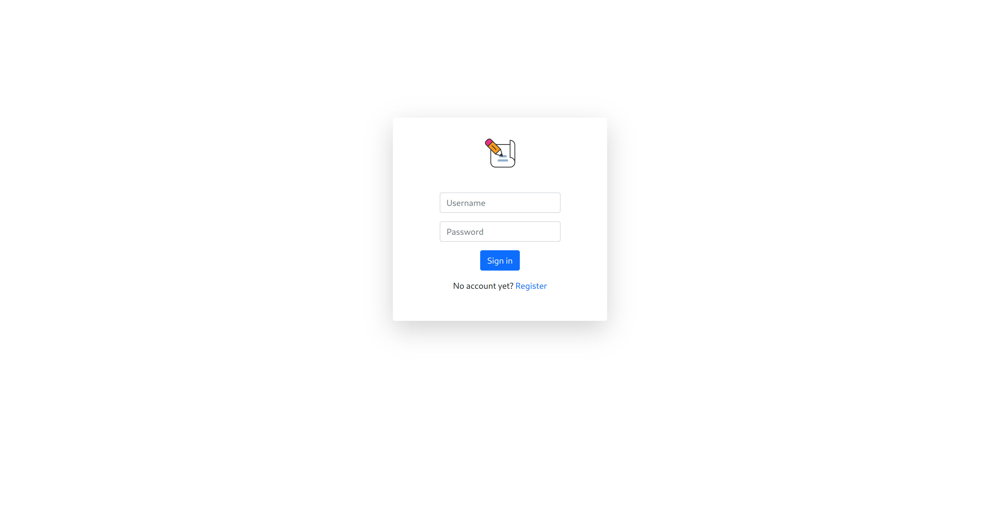
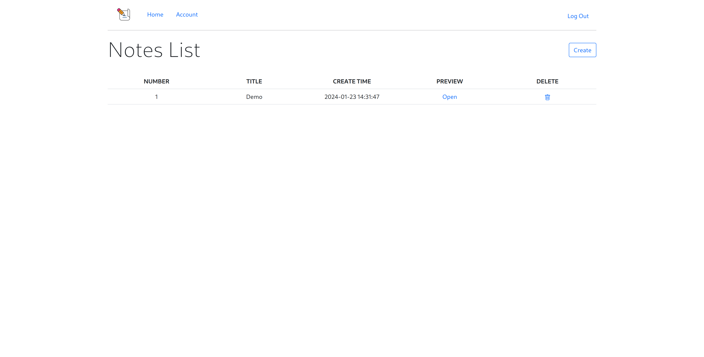
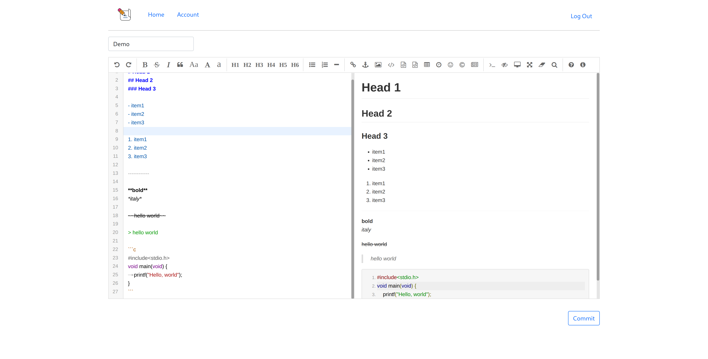
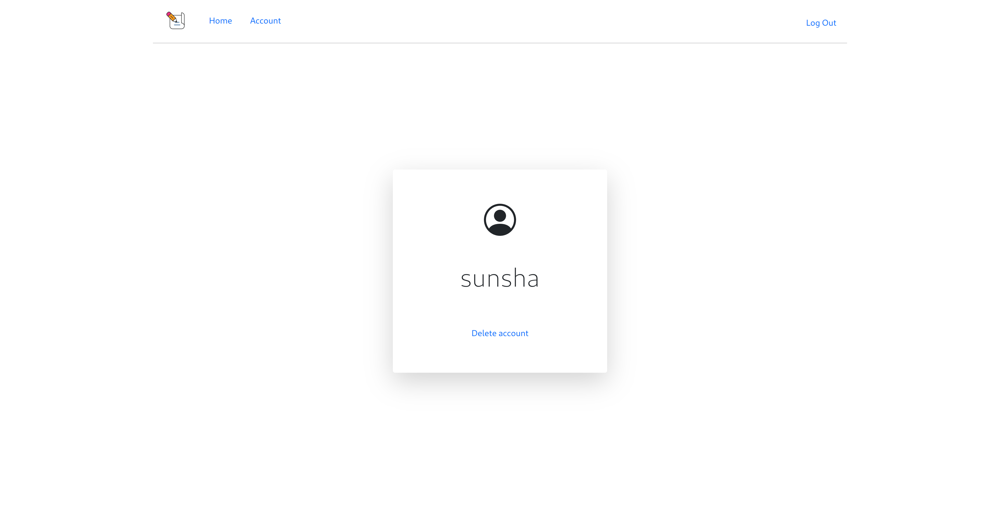

# NoteBliss Web Note APP

> [!NOTE]  
> Final project for CS50x 2023

## Features

- Support user registration and login.

- Support markdown writing notes.

- Support creating, deleting and previewing notes.

- Simple and beautiful UI.

## Run

- Install all requirements

    ```shell
    pip install -r requirements.txt
    ```

- Run locally
    
    In the root directory:

    ```
    flask run
    ```

## Known Issues

- Login error sometimes occurs.

- Markdown rendering error.

## Screenshots






