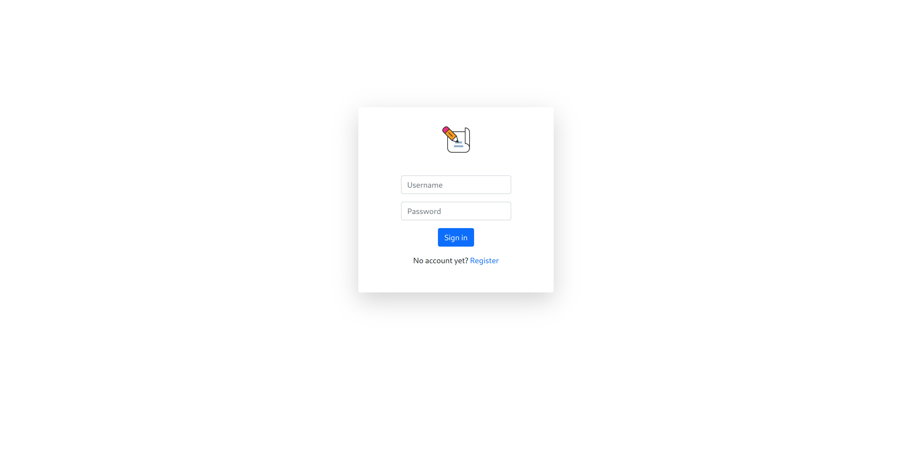
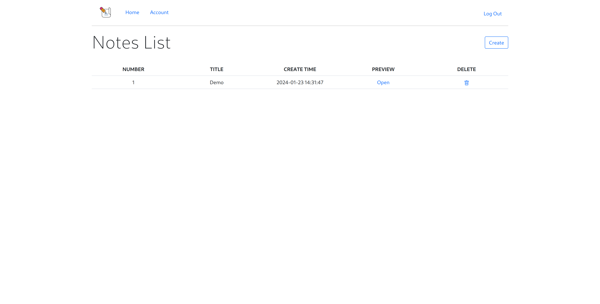
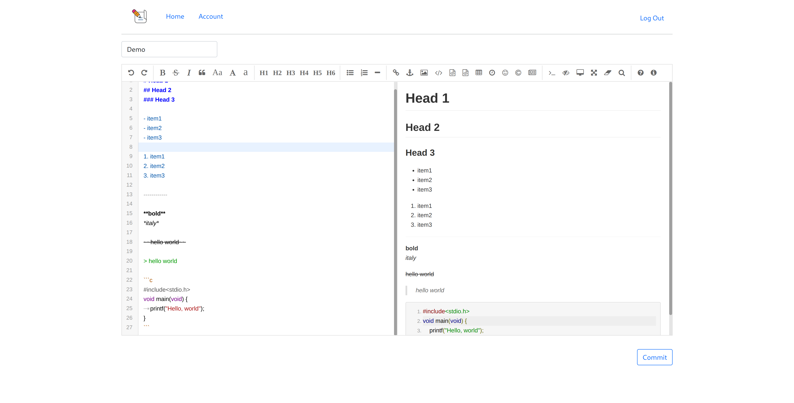
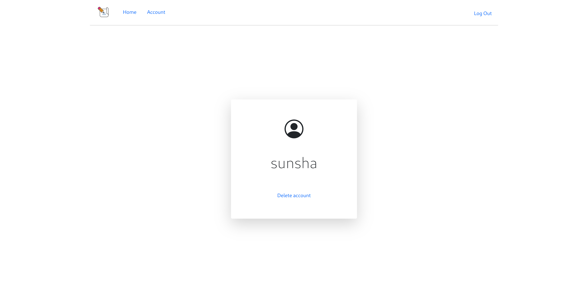

## Features

- Support user registration and login.

- Support markdown writing notes.

- Support creating, deleting and previewing notes.

- Simple and beautiful UI.

## Local build

Using `pythonenv`:

- Install pythonenv

    Archlinux:

    ```
    sudo pacman -S python-virtualenv
    ```

- Git clone this repository and cd into the dir

- Activate pythonenv
    
    [Fish shell](https://github.com/fish-shell/fish-shell):

    ```
    mkdir pythonenv && cd pythonenv
    virtualenv pythonenv3_11
    source pythonenv3_11/bin/activate.fish
    ```

- Install all requirements

    ```shell
    pip3 install -r requirements.txt
    ```

- Run locally
    
    In the root directory:

    ```
    flask run
    ```

## Known Issues

- Login error sometimes occurs.

- Markdown rendering error.

## TODO

- [ ] Change the Markdown rendering method.

- [ ] Beautify the interface and add more useful features.

## Screenshots






